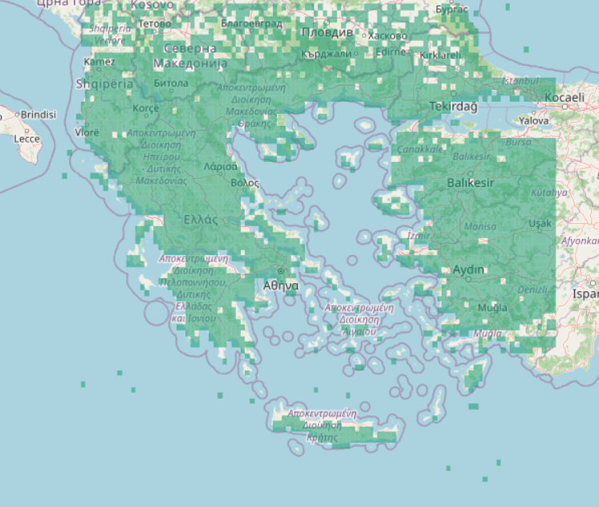

# fire_prediction

# Wildfire Prediction Models

This repository contains Python scripts for wildfire prediction using meteorological and environmental data.  
The project focuses on training deep learning and machine learning models, generating fire-risk heatmaps, and applying explainability techniques.

## Files

### `unet_train.py`
Trains an improved UNet model for wildfire prediction on gridded meteorological data.  
It includes preprocessing, feature engineering, gap-aware 7-day windowing, masked focal loss, train/validation/test split, evaluation metrics, and explainability outputs.

### `unet_sensitivity.py`
Performs sensitivity analysis for the trained UNet model.  
It is used to understand how input features or spatial regions affect the wildfire prediction output.

### `export_heatmap.py`
Generates an interactive HTML heatmap dashboard using predictions from the trained UNet model.  
It can automatically select high-fire-risk days or use specific dates provided by the user.

### `elevated_unet.py`
Implements an uncertainty-aware extension of the trained UNet model using a residual conditional VAE.  
It produces mean fire-risk predictions and uncertainty maps.

### `elevated_unet_occlusion_sensitivity.py`
Runs occlusion sensitivity analysis on the elevated UNet model.  
It shows which spatial areas influence the base risk prediction, elevated risk prediction, and uncertainty estimation.

### `conv2dupdatetdmodern.py`
Contains a Vision Transformer / Conv2D-based wildfire prediction model.  
It uses spatio-temporal meteorological grids and compares deep learning behavior against UNet-style models.

### `train_hybrid_rocket.py`
Trains a Hybrid MiniRocket model for cell-level wildfire prediction.  
It uses time-series transformations, spatial neighbor features, calibration, threshold tuning, and evaluation on validation/test data.

### `train_lstm.py`
Trains classical and neural machine learning models for wildfire classification.  
It includes feature engineering, SMOTE balancing, scaling, and comparison between Logistic Regression, Random Forest, XGBoost, LightGBM, MLP, and ensemble models.

## Goal

The goal of the repository is to compare different approaches for wildfire prediction:

- tabular machine learning models
- time-series models
- UNet-based spatial prediction
- transformer-based spatial prediction
- uncertainty-aware wildfire risk mapping
- explainability and sensitivity analysis

## Requirements

Main libraries used:

```bash
pip install numpy pandas tensorflow scikit-learn matplotlib xgboost lightgbm imbalanced-learn sktime joblib
```

## Dataset

This dataset provides daily meteorological, hydrological, drought, and fire-weather records across a regular spatial grid covering the entire territory of Greece, including all major island groups.  
It is designed for machine learning and deep learning models focused on wildfire occurrence prediction.

| Property | Value |
|---|---|
| Total records | 108,200 |
| Unique grid locations | 3,402 |
| Date range | 2 Jan 2015 – 22 Aug 2025 |
| Unique dates | 3,432 |
| Fire event records (`y_fire = 1`) | 26,835 |
| Grid resolution | 0.1° longitude × 0.2° latitude |
| Latitude extent | 34.3°N – 42.4°N |
| Longitude extent | 19.0°E – 29.7°E |

---

## Spatial Coverage

The dataset covers all administrative regions of Greece using a regular ERA5-style reanalysis grid.

Grid cells located entirely over open sea are excluded. Only land and coastal cells with valid data are retained.

Covered regions include:

- Mainland Greece
  - Attica
  - Central Greece
  - Peloponnese
  - Epirus
  - Thessaly
  - Western Greece

- Northern Greece
  - Macedonia
  - Thrace

- Crete

- Ionian Islands
  - Corfu
  - Kefalonia
  - Zakynthos
  - Lefkada

- Aegean Islands
  - Cyclades
  - Sporades
  - Northern Aegean

- Dodecanese
  - Rhodes
  - Kos
  - Lesbos
  - Chios
  - Samos

---

## Variables

Each row corresponds to one spatial grid cell on one specific date.

| Column | Unit | Description |
|---|---|---|
| `date` | YYYY-MM-DD | Date of the record |
| `lat` | degrees N | Latitude of the grid cell centre |
| `lon` | degrees E | Longitude of the grid cell centre |
| `t2m` | K | 2-metre air temperature |
| `d2m` | K | 2-metre dew point temperature |
| `u10` | m/s | 10-metre U-component of wind |
| `v10` | m/s | 10-metre V-component of wind |
| `tp` | m | Total precipitation |
| `fwi` | — | Fire Weather Index |
| `KBDI` | — | Keetch-Byram Drought Index |
| `PET` | mm/day | Potential Evapotranspiration |
| `D` | — | Drought factor |
| `SPEI_30` | — | Standardised Precipitation-Evapotranspiration Index (30-day) |
| `SPEI_90` | — | Standardised Precipitation-Evapotranspiration Index (90-day) |
| `SPEI_180` | — | Standardised Precipitation-Evapotranspiration Index (180-day) |
| `y_fire` | 0 / 1 | Target variable — wildfire occurrence (`1 = fire recorded`) |

---

## Data Sources

The dataset integrates information from multiple environmental and fire-related sources:

- ERA5 reanalysis meteorological data
- Fire Weather Index (FWI) products
- Drought indicators and hydrological indices
- Satellite-based burned area products
- Official wildfire perimeter datasets

---

## Notes

- Meteorological variables (`t2m`, `d2m`, `u10`, `v10`, `tp`) originate from ERA5 reanalysis datasets.
- SPEI variables may contain `NaN` values at early timestamps due to rolling baseline warm-up periods.
- The `y_fire` label is derived from wildfire perimeter and burned-area observations.
- Coordinates represent the centre of each spatial grid cell.
- The dataset spans approximately 10 years of daily observations.

---

## Intended Usage

This dataset is intended for:

- Wildfire occurrence prediction
- Spatiotemporal deep learning
- Explainable AI (XAI) research
- Climate-risk modelling
- Environmental data mining
- Fire danger assessment


